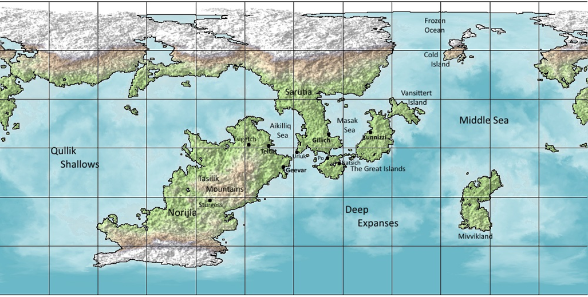

With the known scientists secured and valuable intel gathered, the search for **Mayra Reiss** remained the crew’s priority. As the crew made preparations to investigate the cargo sector of Nox Station, they encountered an unexpected ally: **Vlorp**—a roach-like alien with a voice uncannily similar to a certain Terran puppet. Rick took a liking to him immediately. Zeren, cautious, allowed him to join the team.

The group entered the **cargo bay**, sprawling and dim, riddled with rust and decay. They split up to search. Zeren brushed too close to a corroded pipe, which burst with scalding steam—startling but harmless. Rick and Vlorp found nothing of note at first. But Zeren spotted a man trying to jimmy open a locked container.

The man bolted at the sight of Zeren.

Zeren gave chase, catching the man mid-run and slamming him into the wall. When confronted, the man flashed an SMG. Zeren didn’t flinch—he drew his pistol and pressed it into the man’s gut while choking him with a forearm.

“What were you after?” Zeren growled. The man, clearly shaken, claimed it was just a tip about possible loot. Zeren released him.

The thug spat in Zeren’s face. “I’ll remember you,” he hissed before disappearing into the shadows.

Meanwhile, Rick sidestepped a glitching maintenance bot, and Vlorp, after a thorough search, noticed something odd: a section of wall **too cold**, slick with condensation. Pulling back the panels, he revealed a hidden **access tunnel**.

He crawled through and emerged into a **two-story chamber**, the upper balcony wrapping around the open lower level. The air was foul, and a low electrical hum echoed through the chamber.

Climbing to the second floor, Vlorp's antennae twitched—he heard a muffled “shhh” and the shifting of boots. Three figures—guns trained on the ladder—waited silently above.

Vlorp slipped back down and hid, messaging Rick and Zeren his discovery.

The team regrouped. Zeren attempted to lure the thugs out by pretending to be a drunk spacer, but the trap failed. A **grenade** rolled across the floor and detonated, catching them all. The ambush had begun.

Gunfire erupted.

Zeren and Rick were both hit. Zeren managed to blind two attackers with his flashlight and fired his pistol, grazing one. But a third gunman struck Zeren from an alternate angle—leaving the captain badly wounded.

Vlorp charged in, landing blows. A fourth attacker appeared but failed to hit. Rick laid down suppressive fire, pinning the enemy. Vlorp missed his next shot and took **heavy fire** in return, his carapace absorbing most of the impact. Rick’s armor deflected two more volleys.

Returning fire, Rick’s **pulse rifle tore through the thugs**, downing one. The remaining enemies panicked and **retreated to a far room**, slamming the door behind them. Vlorp, not letting up, finished off another as he fled.

Rick pounded on the barricaded door. Inside, the thugs yelled that they **surrendered**, but refused to open the door.

“Are you here for the scientist?” one called out. “She’s already gone. Yesterday.”

While Rick questioned them, Vlorp investigated the nearby room. As he entered, an **ominous beep** sounded. He dove back as a **mine exploded**, barely escaping.

Rick calmed Vlorp, urging caution.

Behind the other door, Vlorp found a **holding pen**—simple beds, a nightstand, a lamp. A cell.

Rick shoulder-rammed the barricaded door open. Inside, two thugs were crouched behind crates. Caught by surprise, they threw up their hands. The room contained **ration crates, power hookups, drag marks**, and scattered cargo.

“Where is she?” Rick demanded.

The thugs didn’t resist. “She’s gone. Already out of the system. You won’t catch them.”

Zeren arrived, injured but standing. Under pressure, the thugs confessed: **Miller**, their boss, was a commissar—always hunting **psions**. They had taken **Mayra Reiss**, placed her in a **cryotube**, and shipped her off aboard a vessel called the **Ebony**.

Destination: the **Autolye System**, with a layover in the **Neerja System**—both largely uncharted by Laurian standards.

Rick motioned to Zeren to help secure the prisoners. Vlorp collected leftover ammo. Zeren retrieved a dagger from one of the fallen.

With the information secured, the crew gathered in the hangar. Robocop rejoined them, and the remaining scientists were escorted back. Zeren met with **Keith Collins**, the station's administrator, informing him of the situation—two raiders dead, two captured, five scientists retrieved. Collins knew little of Autolye or Neerja, only that **Autolye** was isolationist and **Neerja** was a lawless frontier.

Before leaving, **Vlorp handed Zeren an omnicom** taken from the thugs. Hacking into it, Zeren discovered files and logs identifying **four additional raiders** still on-station.

A message was sent to Laurian Command. It would take hours to reach them. In the meantime, Vlorp, Rick, and Robocop **returned to the hunt**.

---

They started at Vlad’s Bar.

Vlad, unimpressed to see Rick again, warmed slightly at the sight of Vlorp. “Your bug friend’s got taste,” he said, handing Vlorp a cane-sugar drink. Rick asked about the remaining thugs. Vlad pointed toward the **HABs**.

As they left, Vlorp forgot to pay. The bouncer stepped in. Rick tossed credits on the counter to settle it.

Splitting up, they searched the residential decks. Vlorp eventually spotted four unfamiliar figures—**not locals**. They spotted him too.

Vlorp messaged the others and regrouped. They coordinated a flank: Robocop from one end of the corridor, Vlorp and Rick from the other. The four were caught in a perfect pincer and **surrendered without a fight**.

---

A transmission arrived from **Lt. Cmdr. Morretta**.

The Rangers were ordered to rendezvous with a patrol who would **escort the rescued scientists and captured raiders**. From there, the crew was to jump to the **Neerja System** and pursue the Ebony.

Robocop, to their regret, would remain behind—reassigned by command.

The handoff complete, the crew made the **two-week FTL jump**, Zeren taking over basic maintenance duties. During the voyage, each took time to refine their combat and technical skills.

---

They arrived in Neerja.

Scans revealed a **lush, biologically rich world** within the habitable zone. There were no stations. No satellites. No space traffic.

But there were signs of **primitive civilizations**.

This was where the trail led.

---

### **Current Status**

- **Mayra Reiss** confirmed to have been taken off-world aboard the **Ebony**
- Crew successfully captured **six raiders**, killed **two**, and secured **five scientists**
- Robocop reassigned; current crew is Zeren, Rick, and Vlorp
- Intel confirms raiders are part of a psion-hunting faction led by **Commissar Miller**
- Ship en route likely bound for **Autolye System**, with a stop in **Neerja**
- **Neerja** shows signs of primitive civilization; no known infrastructure
- FTL drive requires 1 week to recharge before next jump

**Casualties**

- Rangers: Zeren critically injured but recovered
- Enemies: 2 dead, 6 captured
- Civilian scientists: all 5 recovered safely

**Recommendations**

- Search Neerja surface for signs of Ebony landing
- Identify any native threats or potential interference
- Investigate rumored psionic interest and Miller’s cult-like operations
- Re-establish contact with Laurian Command upon system re-entry
